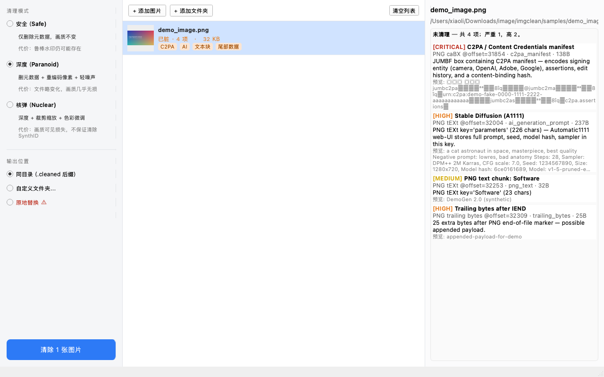

# image-fingerprint-remover

> **Strip EXIF, GPS, C2PA / Content Credentials, AI watermarks, and Stable Diffusion / ComfyUI / Midjourney / ChatGPT prompt blocks from any image — fully offline.**

A privacy-first desktop app + CLI that removes every identifying fingerprint embedded in your images, with first-class support for the AI provenance markers that ship inside images generated by **ChatGPT, DALL·E, Midjourney, Adobe Firefly, Stable Diffusion, and ComfyUI**.

[](LICENSE)
[](https://www.python.org/)
[]()
[]()



## Why this exists

Images you share online are loaded with identifiers most people never see:

- **EXIF** — your camera serial number, lens serial, capture date, and **GPS coordinates of your home**.
- **C2PA / Content Credentials** — cryptographically-signed provenance manifests that link the file back to **OpenAI, Adobe, Google, or Leica**. Increasingly required by law (EU AI Act, China generative-AI labelling rules) and shipped by default in every ChatGPT image since 2024.
- **AI generation prompt blocks** — Stable Diffusion A1111 writes your full prompt, negative prompt, seed, model hash, and sampler into a PNG `tEXt` chunk. ComfyUI embeds the entire node graph as JSON. Midjourney puts your prompt in `Description`.
- **IPTC `DigitalSourceType = trainedAlgorithmicMedia`** — the IPTC standard "this is AI-generated" tag.
- **Photoshop edit history**, embedded thumbnails (often the unedited original), JPEG quantization-table fingerprints, JFIF/MPF/Adobe APP segments, and trailing payloads appended after end-of-file markers.

**`image-fingerprint-remover` detects every category and offers three escalating cleaning modes** — from a byte-identical metadata strip to an aggressive watermark-disruption pass.

## Features

- **Comprehensive detector** for PNG and JPEG containers, walking every chunk / segment at the byte level
- **Three cleaning modes**:
  - `safe` — strip metadata only, pixels byte-identical (verified via SHA256)
  - `paranoid` — also re-encodes pixels with light Gaussian noise to neutralize JPEG quantization-table fingerprints
  - `nuclear` — also resize / crop / color-shift to disrupt frequency-domain robust watermarks (Google SynthID, Digimarc, IMATAG)
- **Both CLI and native desktop GUI** (PySide6, three-pane single-window app with drag-and-drop, parallel inspection, sequential cleaning with cancel support)
- **Fully offline** — no telemetry, no cloud uploads, no phone-home. Your images never leave your machine.
- **JSON output** for scripting and automation pipelines
- **Honest about robust watermarks** — we tell you what we cannot guarantee, rather than pretending

## Quick start

### Install

```bash
git clone https://github.com/lhfer/image-fingerprint-remover.git
cd image-fingerprint-remover
python3 -m venv .venv
.venv/bin/pip install Pillow numpy PySide6   # PySide6 only needed for the GUI
```

### CLI

```bash
# What identifiers does this image carry?
.venv/bin/python -m imgclean inspect photo.jpg

# Strip them (pixels unchanged)
.venv/bin/python -m imgclean clean photo.jpg -o cleaned.jpg

# Aggressive mode — also disrupts pixel-domain watermarks
.venv/bin/python -m imgclean clean photo.png -m nuclear -o cleaned.png

# Batch clean a folder
.venv/bin/python -m imgclean batch ./my-photos --recursive -m safe

# Compare two files (metadata diff + pixel SHA256)
.venv/bin/python -m imgclean diff original.png cleaned.png

# JSON output for any command
.venv/bin/python -m imgclean inspect image.png --json
```

Exit codes: `0` = clean / success · `1` = identifying metadata present (inspect) or residual after clean · `2` = usage / I/O error.

### GUI

```bash
.venv/bin/python -m imgclean_gui
```

Drag images or folders onto the window. Each file is inspected in parallel and rendered with its detection status and category badges. Pick a mode, click "清除 N 张图片", done.

### Web app

```bash
.venv/bin/pip install -r requirements-web.txt
.venv/bin/python -m imgclean_web
```

Open `http://127.0.0.1:8000` to upload PNG/JPEG images, choose a cleaning mode, and download cleaned outputs. To bind it for other machines on the network:

```bash
HOST=0.0.0.0 PORT=8000 .venv/bin/python -m imgclean_web
```

For a server deployment, build the bundled Docker image:

```bash
docker build -t image-fingerprint-remover .
docker run --rm -p 8000:8000 -v imgclean-data:/data image-fingerprint-remover
```

Recommended production setup: put HTTPS, request-size limits, rate limiting, and access control in front of the app with Nginx, Caddy, Cloudflare, or your platform ingress. Runtime knobs:

- `IMGCLEAN_WEB_DATA_DIR` — cleaned-file cache directory, defaults to `.web_data`
- `IMGCLEAN_MAX_UPLOAD_MB` — per-file upload limit, defaults to `25`
- `IMGCLEAN_JOB_TTL_SECONDS` — cleaned download cache TTL, defaults to `21600`
- `IMGCLEAN_AUTH_MODE=wechat` plus `WECHAT_APP_ID`, `WECHAT_APP_SECRET`, `WECHAT_REDIRECT_URI`, and `IMGCLEAN_SESSION_SECRET` — enable WeChat QR OAuth login

## What it detects

| Category | Examples |
|---|---|
| **C2PA / Content Credentials** | OpenAI ChatGPT, Adobe Firefly, Google Imagen, Leica camera, Microsoft Designer JUMBF manifests in PNG `caBX` chunks or JPEG APP11 segments |
| **AI generation prompts** | Stable Diffusion A1111 `parameters` (prompt + negative + seed + model hash + sampler), ComfyUI `prompt` / `workflow` (full node graph), InvokeAI, NovelAI, Midjourney `Description` |
| **IPTC AI tags** | `Iptc4xmpExt:DigitalSourceType = trainedAlgorithmicMedia` / `compositeWithTrainedAlgorithmicMedia` |
| **EXIF** | Camera Make/Model, Software, DateTime, ImageDescription, UserComment, ImageUniqueID, HostComputer |
| **GPS** | EXIF GPS IFD — latitude, longitude, altitude |
| **Device serials** | BodySerialNumber, LensSerialNumber, SerialNumber |
| **ICC color profiles** | Embedded color profiles (can carry vendor IDs and custom strings) |
| **Embedded thumbnails** | EXIF IFD1 thumbnail, JPEG MPF, JFXX — often retain pre-edit pixels |
| **Photoshop IRB** | APP13 `8BIM` blocks — original filenames, paths, URLs, IPTC IIM |
| **Adobe APP14** | DCT-transform marker (identifies Adobe encoder) |
| **PNG text chunks** | `tEXt`, `iTXt`, `zTXt` (including compressed) |
| **PNG embedded EXIF** | `eXIf` chunk |
| **Unknown PNG chunks** | Any non-standard ancillary chunk |
| **JPEG quantization tables** | Encoder/camera fingerprint that survives EXIF strip (LOW severity — only removed in `paranoid`/`nuclear`) |
| **Trailing bytes** | Bytes after IEND (PNG) or EOI (JPEG) — possible appended payload |

## Cleaning modes

| Mode | What it does | Pixels bit-identical? | Best for |
|---|---|:---:|---|
| **safe** | Strip every non-essential metadata chunk/segment; drop trailing bytes; keep `IDAT` / scan data byte-for-byte. | ✅ | Posting images on the web while preserving exact quality. |
| **paranoid** | safe + re-encode pixels through a stock encoder + Gaussian noise σ=0.5 + reset filesystem mtime. | ❌ (imperceptible) | Neutralizing JPEG quantization-table fingerprints; bulk sanitization; weakens but does not defeat trained pixel watermarks. |
| **nuclear** | paranoid + resize to 99.7% + crop 2px + per-channel color bias + transcode through a different codec. | ❌ (visible-but-mild) | Best-effort disruption of robust frequency-domain watermarks (Google SynthID, Digimarc, IMATAG). |
| **watermark** | Detect likely visible text watermarks or use a supplied `x,y,w,h` / mask, then inpaint the masked pixels. | ❌ | Removing visible overlay text from images before metadata cleanup. |

## Architecture

```
imgclean/
  imgclean/                  # detection + cleaning engine
    cli.py                   # argparse entrypoint
    detect/
      png.py                 # PNG chunk walker
      jpeg.py                # JPEG marker walker + EXIF/XMP/C2PA parsers
    clean/
      png.py                 # safe / paranoid / nuclear cleaners
      jpeg.py                # same, for JPEG
    findings.py              # Finding / InspectReport types + severity model
    fingerprints.py          # signature database (AI keys, C2PA labels, EXIF tags)
    report.py                # human-readable + JSON formatters
  imgclean_gui/              # PySide6 desktop app
    app.py                   # MainWindow + custom list delegate
    workers.py               # InspectTask (QThreadPool) + CleanWorker (QThread)
  tests/                     # 12 end-to-end tests covering each finding category
  scripts/                   # GUI smoke test, demo image generator, screenshot maker
```

## Known limitations

We are honest about what we cannot guarantee:

- **Robust pixel-domain watermarks** (Google SynthID, Digimarc, IMATAG, Steg.AI) are co-trained against crop / resize / JPEG / color shift. The `nuclear` mode disrupts them but does not guarantee removal. There is **no public SynthID-Image detector** to verify removal against.
- **C2PA durable credentials** that include a server-side hash lookup survive any local sanitization — the originating service can still match by content hash even after the on-disk manifest is gone. Local stripping defeats the manifest-on-disk binding only.
- **MakerNote** in Canon / Nikon / Sony JPEGs is partially proprietary. We strip the whole block but do not enumerate every internal tag.
- **HEIC / WebP / AVIF / TIFF / GIF** containers are recognized but not yet fully cleaned in this build. PNG and JPEG are the supported targets.
- **PRNU sensor noise** is a pixel-statistics fingerprint and cannot be removed without destructive denoising.

If you need stronger guarantees against trained watermarks, the only known reliable approach is **latent re-diffusion** (encode → noise → denoise → decode through a local Stable Diffusion model). That is out of scope for this MVP.

## Tests

```bash
.venv/bin/pip install -r requirements-dev.txt
.venv/bin/python -m pytest tests/ -v                                         # engine tests
QT_QPA_PLATFORM=offscreen .venv/bin/python scripts/gui_smoke.py              # headless GUI smoke
```

The engine ships with 12 end-to-end tests covering every finding category and asserting `safe` mode preserves pixels bit-identically.

## 中文 / Chinese

**图像指纹清理工具** — 检测并清除图像中所有可能携带的识别元素：

- **EXIF / GPS / 设备序列号 / 拍摄时间**
- **C2PA 内容凭证清单**（ChatGPT、Adobe Firefly、Google Imagen 等都会嵌入这种数字签名清单）
- **AI 生成提示词**（Stable Diffusion A1111 的 `parameters`、ComfyUI 的 `prompt`/`workflow` 节点图、Midjourney 的提示词块、Adobe Firefly 标签）
- **IPTC 标准的 AI 生成标签**
- **Photoshop 编辑历史 / 嵌入缩略图 / JPEG 量化表指纹 / 尾部追加数据**

三档清理模式：**安全（像素不变）**、**深度（重编码 + 轻噪声）**、**核弹（缩放裁剪 + 色彩微调，扰乱鲁棒水印）**。提供命令行 + macOS 原生桌面应用（PySide6，支持拖拽、批量、并行检测），100% 本地运行，不联网。

## Contributing

Issues and PRs welcome. Particularly interested in:
- HEIC / WebP / AVIF / TIFF cleaning paths
- Better robust-watermark detection heuristics
- Linux / Windows GUI polish
- Localization beyond Chinese / English

## License

MIT — see [LICENSE](LICENSE).

## Acknowledgments

- The C2PA / Content Authenticity Initiative for publishing the JUMBF spec openly
- Phil Harvey's [ExifTool](https://exiftool.org/) — the reference implementation for image metadata that every project in this space owes a debt to
- The Stable Diffusion and ComfyUI communities for documenting their PNG metadata conventions
